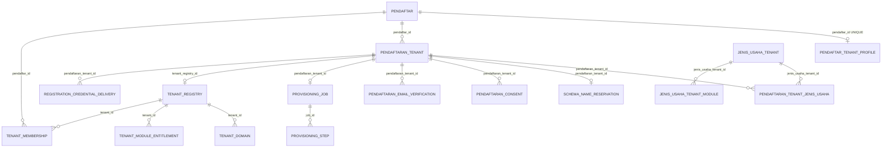

# 04 — ERD Control-Plane (implementasi nyata)

- Java: paket `ais.database.model.tenant` (16 entity, +PENDAFTARAN_AUDIT_EVENT berdiri sendiri
  dgn id polos, tidak digambar).
- Entity existing TIDAK diubah: `Brand/Toko/Investor/AkunManajemen` tetap scope `pendaftar`;
  scope `tenant` utk data operasional dilakukan additive di fase gating/onboarding (P5) TANPA
  memutus data lama (tenant default per Pendaftar dibentuk saat backfill disetujui — §16.4).
- Detail kolom: lihat 07-data-dictionary.md; workflow: 05-workflow.md.
