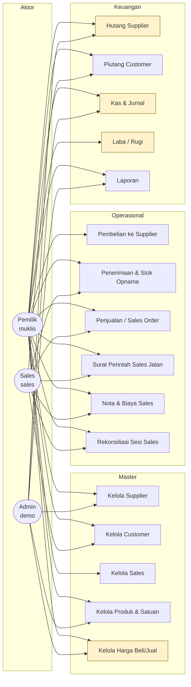
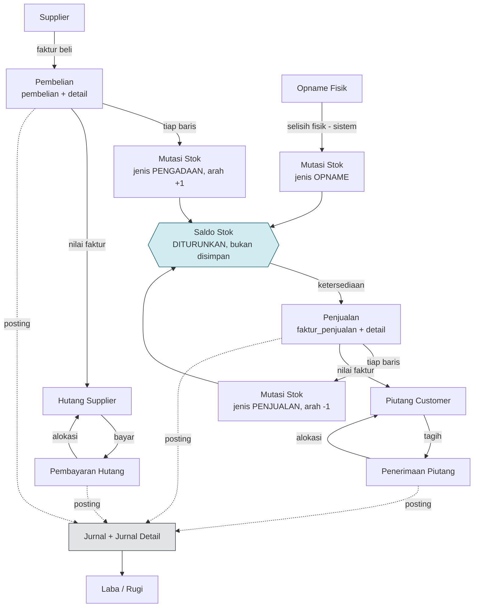
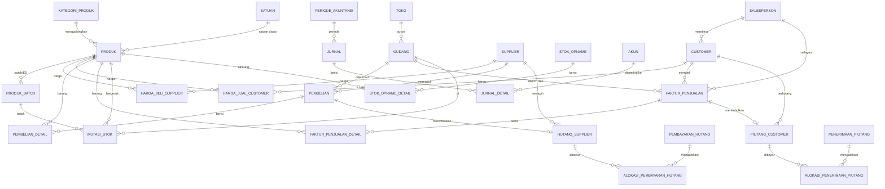

# 121 — Manual Pengguna: eBisnis Inventory & Sales (tenant `cmnmedika`)

**Tanggal:** 2026-09-06
**Status:** kerangka + tiga diagram **selesai**; narasi per layar menunggu tangkapan layar.

> **Batas dokumen ini, dinyatakan di depan.** Permintaan aslinya adalah manual "dari screenshot
> yang sudah dinyatakan sukses". Sampai 48 layar diadu dengan `inventory.exe`, **belum ada satu
> tangkapan layar pun yang sah dinyatakan sukses**. Yang selesai di sini adalah bagian yang tidak
> bergantung pada tangkapan layar: ketiga diagram (diturunkan dari schema dan izin peran yang
> sudah terpasang dan terverifikasi), alur bisnis, serta kerangka tiap bab. Tempat gambar ditandai
> `[GAMBAR-nn]` agar mudah dilengkapi tanpa menulis ulang narasinya.

---

## 1. Untuk siapa dokumen ini

Tiga peran, dan ketiganya sudah aktif serta terverifikasi dapat masuk:

| pengguna | peran | jangkauan menu | untuk siapa |
|---|---|---|---|
| `muklis` | Pemilik (`OWNER`) | 16 dari 16 | pemilik usaha — seluruh area, termasuk menyetujui |
| `sales` | Sales (`SALES_KELILING`) | **9 dari 16** | sales lapangan — perjalanan, penjualan, penagihan |
| `demo` | Admin (`ADMIN_TENANT`) | 16 dari 16 | administrator |

Perbedaan jangkauan itu **nyata, bukan hiasan**. Tujuh menu yang tidak dimiliki Sales:
`master_supplier`, `master_sales`, `hutang`, `kas_jurnal`, `laba_rugi`,
`laporan_inventory_sales`, dan `harga`. Yang terakhir disengaja — **sales lapangan boleh melihat
harga, tidak boleh mengubahnya**, sehingga nota di lapangan tidak bisa dimain-mainkan.

---

## 2. Use Case Diagram

Diturunkan dari izin yang benar-benar terpasang pada `tbmrole.ebisnis_menu`, bukan dari
rancangan di atas kertas.



Kotak berwarna = **tidak dapat diakses Sales**. Admin dan Pemilik sama-sama penuh; bedanya
administratif, bukan jangkauan menu.

---

## 3. Flow Diagram — alur bisnis utama

Alur ini bukan rancangan; ia mencerminkan bagaimana data benar-benar mengalir di basis data,
dan setiap panah dapat ditelusuri lewat kunci asing pada §4.



### Tiga hal yang wajib dipahami sebelum memakai sistem ini

**Stok adalah TURUNAN, bukan kolom.** Tidak ada satu pun tempat yang menyimpan "sisa stok".
Saldo mana pun adalah penjumlahan `mutasi_stok`. Akibat praktisnya: **stok tidak bisa
"diperbaiki" dengan mengetik angka** — ia hanya berubah lewat pembelian, penjualan, atau opname.
Ini disengaja: angka yang bisa diketik langsung akan berselisih dengan riwayatnya, dan yang mana
yang benar tidak akan pernah punya jawaban.

**Sisa piutang juga TURUNAN**, dihitung dari alokasi penerimaan. Menandai piutang "lunas" tanpa
mencatat penerimaannya tidak akan mengubah apa pun di layar.

**Pembalikan, bukan penghapusan.** Beberapa tabel punya `pembalik_dari_id` (pembelian, faktur,
mutasi, pembayaran, penerimaan, jurnal). Dokumen yang salah **dibalik**, bukan dihapus — jejaknya
tetap ada, dan itulah yang membuat laporan bulan lalu tidak berubah diam-diam.

---

## 4. ERD — Aliran Data

Diturunkan dari kunci asing yang benar-benar ada di schema `cmnmedika`, bukan direka.



**Yang sengaja TIDAK ada di ERD ini: tabel "saldo".** Bila Anda mencarinya dan tidak menemukannya,
itu bukan kekeliruan gambar — lihat §3.

Akuntansi berada di schema tenant yang sama (`{S}.akun`, `{S}.jurnal`), sesuai keputusan yang
diambil 2026-09-06 (doc 114): **tidak** memakai kolom pembeda di `akunting.*`.

---

## 5. Kerangka bab per layar

Tiap bab mengikuti bentuk yang sama. Narasi ditulis lebih dulu; gambar menyusul setelah
tangkapan layarnya dinyatakan sah.

> **Bentuk baku tiap bab**
> 1. **Untuk apa layar ini** — satu paragraf, dari sudut pandang pekerjaan, bukan tombol.
> 2. `[GAMBAR-nn]` — tangkapan layar UI baru.
> 3. **Membaca layarnya** — kolom demi kolom, dan dari mana angkanya berasal.
> 4. **Langkah kerja** — urutan bernomor.
> 5. **Yang berubah di belakang layar** — tabel mana yang tersentuh (rujuk §4).
> 6. **Kesalahan yang sering terjadi** — beserta pesan yang akan muncul.

| bab | layar | peran | status data |
|---|---|---|---|
| 5.1 | Master Supplier | P, A | **terverifikasi** — 101 baris setara DBF |
| 5.2 | Master Customer | P, S, A | **terverifikasi** — 333 baris |
| 5.3 | Master Sales | P, A | **terverifikasi** — 3 baris |
| 5.4 | Master Produk & Satuan | P, A | **terverifikasi** — 626 baris |
| 5.5 | Master & Analisis Harga | P, A | **terverifikasi** — 2.512 + 11.685 |
| 5.6 | Persediaan & Kartu Stok | P, S, A | **terverifikasi** — saldo 626/626 selisih 0,00 |
| 5.7 | Laporan Opname (layar legacy 09) | P, S, A | **terverifikasi** — 461 sesi |
| 5.7b | Rincian Sesi Opname (layar legacy 10) | P, S, A | **terverifikasi** — 1.771 rincian |
| 5.8 | Pembelian | P, A | **terverifikasi** — 5.578 dokumen, baris & total cocok |
| 5.9 | Hutang Supplier | P, A | **terverifikasi** — 21 baris |
| 5.10 | Penjualan / Sales Order | P, S, A | **terverifikasi** — 9.850 dokumen |
| 5.11 | Piutang Customer | P, S, A | **terverifikasi** — 108 baris |
| 5.12 | Surat Perintah Sales Jalan | P, S, A | belum ada data uji |
| 5.13 | Nota & Biaya Sales | P, S, A | belum ada data uji |
| 5.14 | Rekonsiliasi Sesi Sales | P, S, A | belum ada data uji |
| 5.15 | Kas & Jurnal | P, A | bagan akun 11 baris; jurnal belum ada |
| 5.16 | Laba / Rugi | P, A | menunggu jurnal |
| 5.17 | Laporan Inventory & Sales | P, A | menunggu tangkapan layar |

> **Layar 5.7 dan 5.7b sempat menampilkan NOL, dan itu bukan soal data.** Rentang 09-10
> dulu jatuh ke layar Stok Opname POS, yang membaca lewat entitas Hibernate ber-
> `@Table(schema=...)` sehingga tidak dapat melihat schema tenant. Sejak r86049 keduanya
> dilayani `si_stock_count_list` / `si_stock_count_detail` pada jalur tenant — lihat
> [122](122-layar-09-10-laporan-opname.md).

"Terverifikasi" berarti **angka yang akan tampil sudah dibuktikan setara dengan berkas DBF
aplikasi lama** (doc 120) — bukan berarti tampilannya sudah dibandingkan.

---

## 6. Yang harus dikerjakan agar manual ini selesai

1. **48 tangkapan layar** dari UI baru pada tenant `cmnmedika`, diadu dengan `inventory.exe`.
   Otomasi tidak mungkin di sesi ini (doc 110); jalurnya uji integrasi Flutter atau manual
   (doc 111).
2. Isi `[GAMBAR-nn]` dan lengkapi butir 3–6 tiap bab.
3. Layar sesi sales (5.12–5.14) belum punya data uji — perlu disemai atau dinyatakan di luar
   lingkup UAT pertama.

## Lampiran — cara menyalakan lingkungan UAT

```
klaster : pg_ctl -D C:\opt\uat-inventory\pgdata -o "-p 55600" start
instans : docs/tenant-inventory-sales/bangun-instans-uat.ps1   (bila perlu dibangun ulang)
server  : CATALINA_BASE=C:\opt\uat-inventory\tomcat-uat, catalina.bat run
alamat  : http://127.0.0.1:18080/ais
akun    : muklis/muklis123 · sales/sales123 · demo/demo123
```
