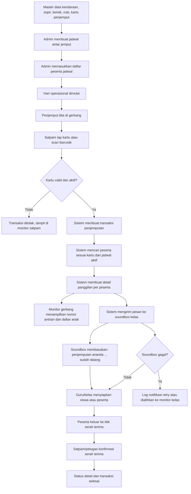

# Flow Modul Antar Jemput Siswa, Guru, Mahasiswa, Dosen, dan Pegawai

Modul antar jemput ini dirancang mengikuti praktik umum di sekolah atau kampus yang memiliki layanan kendaraan operasional, gerbang keamanan, monitor antrian, dan pengumuman otomatis ke kelas. Prinsip utamanya adalah memisahkan master data, jadwal operasional, manifest peserta, kartu penjemput, transaksi harian, detail panggilan, dan log notifikasi. Pemisahan ini penting karena proses antar jemput bukan sekadar data kendaraan, tetapi rangkaian kontrol keselamatan. Dalam praktik lapangan, petugas harus tahu siapa yang menjemput, peserta mana yang boleh dijemput, kendaraan dan petugas mana yang sedang bertugas, kelas mana yang perlu dipanggil, serta bukti waktu mulai dari kedatangan penjemput sampai serah terima.

Flow dimulai dari master data. Kendaraan dikelola melalui tabel `kendaraan_antar_jemput`. Tabel ini tidak berdiri sendiri sebagai data kendaraan bebas, tetapi direlasikan ke `ais.database.model.asset.Asset` dan `ais.database.model.asset.AssetDetail`. Dengan relasi ini, kendaraan antar jemput tetap mengikuti inventaris resmi institusi: nomor asset, detail unit, status asset, lokasi, dan histori pengadaan tetap berada di modul asset; sementara kebutuhan operasional antar jemput seperti nomor polisi, kapasitas duduk, sopir, dan kenek disimpan di modul baru. Sopir adalah `Pegawai`, demikian juga kenek. Kenek dibuat maksimal tiga field, yaitu `kenek1`, `kenek2`, dan `kenek3`, dan semua boleh kosong. Model ini sengaja dibuat sederhana karena permintaan bisnis menyebut batas maksimal tiga kenek, bukan komposisi kru dinamis tanpa batas.

Setelah kendaraan, admin mengelola `rute_antar_jemput`. Rute menyimpan nama rute, titik awal, titik akhir, jenis layanan, jam berangkat, estimasi perjalanan, dan status aktif. Jenis layanan dapat dipakai sebagai `JEMPUT`, `ANTAR`, atau `PULANG_PERGI`. Pada implementasi UI nanti, pilihan ini bisa dibuat combobox agar admin tidak mengetik bebas. Data rute berguna untuk proses reguler, misalnya rute pagi dari titik kumpul ke sekolah, rute pulang dari sekolah ke rumah, atau layanan khusus event kampus.

Tahap berikutnya adalah `jadwal_antar_jemput`. Jadwal mengikat rute, kendaraan, sopir, kenek, tanggal, jam mulai, jam selesai, hari, tahun ajaran, semester, dan status operasional. Jadwal ini adalah dokumen kerja harian atau periodik. Pada sekolah, jadwal biasanya dibuat per hari atau per pola mingguan. Pada kampus, jadwal dapat mengikuti kalender akademik atau event. Status jadwal disiapkan sebagai `DRAFT`, `AKTIF`, `SELESAI`, dan `BATAL`. Praktiknya, admin dapat menyusun jadwal dalam status draft, mengecek kendaraan dan petugas, lalu mengaktifkan jadwal sebelum layanan berjalan. Status selesai dipakai untuk mengunci manifest operasional setelah hari layanan berakhir.

Daftar anak atau peserta jemputan disimpan di `peserta_jadwal_antar_jemput`. Tabel ini dapat terhubung ke `Siswa`, `Mahasiswa`, `Guru`, `Dosen`, dan `Pegawai`. Field dibuat nullable karena satu baris peserta idealnya hanya mengisi salah satu jenis orang. Untuk kebutuhan sekolah, peserta siswa dapat memiliki relasi `KelasSiswa`, sehingga sistem dapat mengetahui kelas tujuan pengumuman. Untuk mahasiswa, dosen, guru, atau pegawai, flow panggilan dapat diarahkan ke lokasi yang nanti ditentukan oleh UI atau perangkat tujuan. Peserta juga memiliki nomor urut, titik jemput, titik turun, catatan kesehatan, dan status langganan. Nomor urut berguna untuk manifest kendaraan, sedangkan catatan kesehatan penting untuk siswa kecil atau peserta dengan kondisi khusus.

Kartu dan barcode penjemput disimpan di `kartu_penjemput_antar_jemput`. Di lapangan, satu siswa bisa dijemput oleh ayah, ibu, wali, pengasuh, atau pihak lain yang sudah disetujui. Karena itu kartu menyimpan nama penjemput, hubungan, nomor identitas, nomor HP, nomor kartu, barcode, masa berlaku, dan status aktif. Tabel ini juga bisa direlasikan ke siswa, mahasiswa, guru, dosen, atau pegawai. Pada fase awal, penggunaan paling dominan adalah siswa. Namun karena modul diminta mencakup siswa, guru, mahasiswa, dosen, dan pegawai, struktur model sengaja dibuat generik agar tidak perlu membuat lima tabel kartu yang berbeda.

Pada hari operasional, penjemput datang ke gerbang. Satpam membuka layar scan, lalu melakukan tap kartu atau scan barcode. Dari sisi data, kejadian ini masuk ke `transaksi_penjemputan_antar_jemput`. Transaksi menyimpan waktu scan, tipe scan, nomor scan, pintu gerbang, nomor antrian, status, petugas satpam, kartu penjemput, dan jadwal aktif. Nomor antrian berguna untuk monitor seperti restoran cepat saji: penjemput melihat dirinya sudah masuk antrian, petugas kelas melihat siapa yang harus disiapkan, dan bagian gerbang memiliki urutan yang jelas saat ramai.

Setelah transaksi dibuat, sistem mencari peserta yang cocok dengan kartu penjemput dan jadwal aktif. Untuk setiap peserta yang perlu dipanggil, sistem membuat `detail_penjemputan_antar_jemput`. Detail ini menyimpan orang yang dipanggil, kelas siswa bila ada, teks panggilan, perangkat tujuan, status panggilan, waktu dipanggil, waktu keluar kelas, dan waktu serah terima. Pemecahan transaksi ke detail penting karena satu kartu penjemput bisa menjemput lebih dari satu anak. Misalnya seorang ibu menjemput Ahmad di kelas 1A dan Aisyah di kelas 3B; satu scan di gerbang menghasilkan satu transaksi, tetapi dua detail panggilan dengan perangkat kelas berbeda.

Teks panggilan default dibuat mengikuti contoh client: "Penjemputan ananda Ahmad sudah datang." Pada UI atau service berikutnya, teks ini dapat disesuaikan per jenjang. Untuk siswa kecil, kata "ananda" terasa natural. Untuk mahasiswa, dosen, guru, atau pegawai, teks dapat diubah menjadi lebih formal, misalnya "Bapak/Ibu ... sudah ditunggu di gerbang." Model tidak mengunci format suara karena perangkat TTS atau soundbox bisa punya kebutuhan berbeda.

Pengiriman suara, monitor kelas, atau kanal lain dicatat di `log_notifikasi_antar_jemput`. Log menyimpan detail panggilan, kanal, perangkat tujuan, pesan, status, jumlah percobaan, waktu kirim, dan waktu diterima. Ini adalah bagian penting dalam best practice karena sistem audio tidak selalu berhasil. Jaringan kelas bisa putus, soundbox bisa offline, atau pesan TTS bisa gagal. Dengan log, operator dapat melihat apakah panggilan sudah benar-benar terkirim atau masih antre. Jika gagal, proses bisa retry atau dialihkan ke monitor kelas.

Urutan proses validasi di gerbang sebaiknya ketat. Pertama, sistem cek apakah kartu/barcode terdaftar. Kedua, cek status aktif dan masa berlaku. Ketiga, cek apakah peserta terkait ada dalam jadwal aktif pada hari dan jam tersebut. Keempat, cek apakah peserta sudah pernah dipanggil atau sudah selesai diserahterimakan. Jika kartu tidak valid, transaksi tetap dapat dicatat dengan status `DITOLAK` agar ada audit trail keamanan. Satpam melihat alasan penolakan di monitor dan dapat meminta penjemput menuju administrasi.

Monitor gerbang berfungsi sebagai tampilan antrian. Setelah scan valid, sistem menampilkan nomor antrian, nama penjemput, nama peserta, kelas, dan status. Status awal biasanya `MENUNGGU`, lalu berubah menjadi `DIPANGGIL` setelah log notifikasi soundbox dibuat. Ketika guru atau wali kelas sudah melepas siswa, status detail berubah menjadi `KELUAR_KELAS`. Ketika siswa benar-benar diterima penjemput di titik serah terima, satpam atau petugas menekan konfirmasi sehingga detail berubah menjadi `DISERAHKAN`. Jika semua detail dalam satu transaksi sudah diserahkan, transaksi berubah menjadi `SELESAI`.

Flow ini juga mendukung layanan kendaraan antar jemput reguler. Untuk keberangkatan pagi, manifest peserta pada `peserta_jadwal_antar_jemput` dapat menjadi daftar anak yang harus dijemput oleh sopir dan kenek. Sopir membawa kendaraan yang terhubung ke asset, kenek membantu absensi naik kendaraan, dan titik jemput/turun menjadi panduan rute. Untuk flow pulang sekolah dengan penjemput pribadi, kartu penjemput lebih dominan. Dua mode ini memakai tabel yang sama, sehingga sekolah tidak perlu memiliki modul terpisah untuk shuttle dan pickup gate.

Dari sisi keamanan, relasi ke pegawai untuk sopir, kenek, dan satpam membuat penanggung jawab selalu jelas. Bila terjadi komplain, sistem dapat menunjukkan siapa satpam yang memindai, jam berapa penjemput datang, kelas mana yang menerima suara, kapan anak keluar kelas, dan kapan serah terima dilakukan. Relasi ke siswa/mahasiswa/guru/dosen/pegawai menjaga histori tetap terhubung ke data induk eSchool dan eCampus. Relasi ke asset menjaga kendaraan tetap terhubung ke inventaris dan pemeliharaan.

Implementasi berikutnya yang natural adalah membuat UI master kendaraan, master rute, kartu penjemput, jadwal, manifest peserta, layar scan satpam, monitor antrian, dan service pengirim soundbox. Entity yang dibuat sekarang sudah menyiapkan fondasi tabel untuk kebutuhan itu. Saat Hibernate `hbm2ddl.auto` proyek aktif untuk update/create, mapping baru akan membuat tabel public: `kendaraan_antar_jemput`, `rute_antar_jemput`, `jadwal_antar_jemput`, `peserta_jadwal_antar_jemput`, `kartu_penjemput_antar_jemput`, `transaksi_penjemputan_antar_jemput`, `detail_penjemputan_antar_jemput`, dan `log_notifikasi_antar_jemput`.
